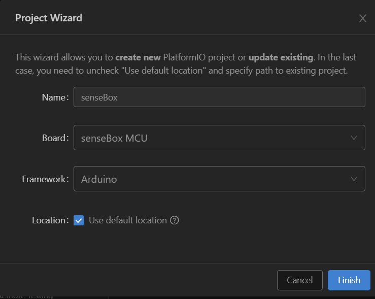

# senseBox VS Code PlatformIO Template

## Deutsch
Als modernere Alternative zur Arduino IDE nutzen wir im Makerspace Partheland Visual Studio Code mit PlatformIO.
Um die fehlende senseBox Board Integration in PlatformIO zu überwinden, da das Issue <https://github.com/platformio/platform-atmelsam/pull/169> seit 2021 offen ist, hier ein Ausgangsprojekt mit Board Definition, notwendigem Variants Ordner und Bibliotheken unter lib. 
Als Quelle diente https://github.com/sensebox/senseBoxMCU-core

### Board Definition hinterlegen

Analog <https://docs.platformio.org/en/stable/platforms/creating_board.html#id3> die hier im Ordner "boards" hinterlegte sensebox_mcu.json in das Core_dir Verzeichnis im Unterordner boards ablegen --> .platformio/platforms/*/boards/
Wie finde ich das core_dir: <https://docs.platformio.org/en/stable/projectconf/sections/platformio/options/directory/core_dir.html#projectconf-pio-core-dir>

Visual Code mit PlatformIO neu starten, das Board ist nun verfügbar.

### SenseBox verwendete Bibliotheken

Alle im Board Support Package von senseBox mitgelieferten Bibliotheken sind im \lib\ Ordner abgelegt. Um neuere Versionen zu nutzen, da diese stellenweise sehr alt sind, einfach in der platformio.ini die jeweilige Zeile unter  lib_deps auskommentieren und das jeweilige alte Verzeichnis im \lib\ Ordner löschen.
!Von arduino-lmic sollte die von senseBox gelieferte Version im \lib\ Ordner genutzt werden, eine neuere Version / eine andere Variante würde nicht ohne weitere Anpassung an senseBox Beispiel oder opensensemap.org Codes funktionieren!

Programmcode wird im \src\ Ordner in der main.cpp abgelegt, analog Arduino.

  

## English

As a more modern alternative to the Arduino IDE, we use Visual Studio Code with PlatformIO at Makerspace Partheland.
To overcome the lack of senseBox board integration in PlatformIO, as the issue <https://github.com/platformio/platform-atmelsam/pull/169> has been open since 2021, here is an initial project with board definition, necessary variants folder and libraries under \lib\
The source was https://github.com/sensebox/senseBoxMCU-core

### Save board definition

Similarly <https://docs.platformio.org/en/stable/platforms/creating_board.html#id3> place the sensebox_mcu.json stored here in the "boards" folder in the core_dir directory in the boards subfolder --> .platformio/platforms/*/boards/
How do I find the core_dir: <https://docs.platformio.org/en/stable/projectconf/sections/platformio/options/directory/core_dir.html#projectconf-pio-core-dir>

Restart Visual Code with PlatformIO, the board is now available.

### SenseBox used libraries

All libraries included in the Board Support Package of senseBox are stored in the \lib\ folder. To use newer versions, as some of them are very old, simply comment out the respective line under lib_deps in platformio.ini and delete the respective old directory in the \lib\ folder.
!The version of arduino-lmic supplied by senseBox in the \lib\ folder should be used, a newer version / another variant would not work without further adaptation to senseBox example or opensensemap.org codes!

Ccode is stored in the \src\ folder in main.cpp, similar to Arduino.
